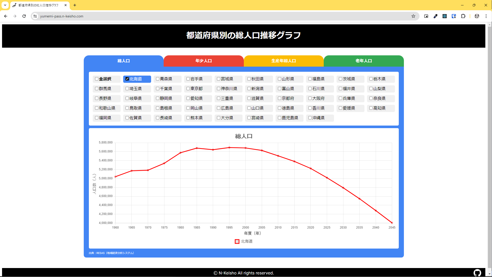

# ゆめみパスポート：フロントエンドコーディング試験

このサイトは株式会社ゆめみ様が発行している，ゆめみパスポートのコーディング試験に応募するために作成したものです．

**都道府県別の総人口推移グラフを表示するSPA** がお題であり，そのデータは [RESAS(地域経済分散分析システム)](https://opendata.resas-portal.go.jp/) から取得しています．



要件は以下のサイトの指示に沿っています．
https://yumemi.notion.site/0e9ef27b55704d7882aab55cc86c999d

# テスト方法
## モジュールテスト
リポジトリをクローン後，以下のコマンドを入力すると実行できます．
```powershell
$ npm install
$ npm run test
```
## E2Eテスト
E2EテストはGitHubActionにて，プッシュ時に自動でテストが行われますが，以下の方法で手動で実行することもできます．

1. リポジトリをクローン後，以下のコマンドを入力して準備を行ってください．
```powershell
$ npm install
$ npm run build
$ npm run start
```
2. 別タブを起動して以下を入力するとテストが実行されます．
```powershell
$ npm run cypress:headless
```


# 各種リンク
## デプロイ先
- Vercel：https://vercel.com/
- デプロイリンク：https://yumemi-pass.n-keisho.com/

## チャートライブラリ
- react-chartjs-2：https://react-chartjs-2.js.org/

## 各種データ
- RESAS：https://opendata.resas-portal.go.jp/

## CL
- Jest : https://jestjs.io/ja/
- Cypress : https://www.cypress.io/

## 参考・使用サイト
### コーディング関連
- ゆめみフロントエンド採用コーディング試験で確認しているポイントやよくある質問を公開｜YUMEMI（株式会社ゆめみ）公式 : https://note.yumemi.co.jp/n/ned7429b59556
- 僕が考える最強のコミットメッセージの書き方 | Qiita : https://qiita.com/konatsu_p/items/dfe199ebe3a7d2010b3e

### チャートライブラリ
- Next.js+TypeScript+Chart.js(react-chartjs-2)の最小構成 : https://zenn.dev/nihashi/articles/1f8a1f828554af
- Next.js(App Router)で使えるチャートライブラリ徹底比較 : https://zenn.dev/ficilcom/articles/6a9b68fbf4c031


### ローディング
- Pure CSS Loader : https://loading.io/css/

### fabicon
-　日本地図のアイコン | アイコン素材ダウンロードサイト「icooon-mono」： https://icooon-mono.com/10163-%E6%97%A5%E6%9C%AC%E5%9C%B0%E5%9B%B3%E3%81%AE%E3%82%A2%E3%82%A4%E3%82%B3%E3%83%B3/

### テスト関連

- フロントエンド(Next.js)のテストについてまとめる | Qiita ： https://qiita.com/suzu1997/items/e4ee2fc1f52fbf505481
- Testing: Jest | Next.js ： https://nextjs.org/docs/app/building-your-application/testing/jest
- テスト | Next.js : https://nextjs-ja-translation-docs.vercel.app/docs/testing
- Testing: Cypress | Next.js : https://nextjs.org/docs/pages/building-your-application/testing/cypress
- GitHub Actions | Cypress Documentation : https://docs.cypress.io/guides/continuous-integration/github-actions
