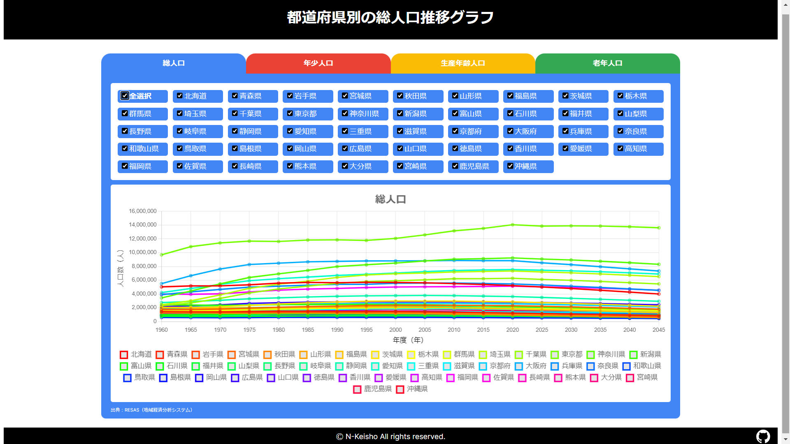
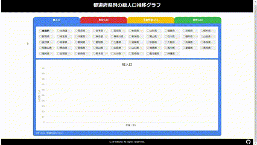

# ゆめみパスポート：フロントエンドコーディング試験

このサイトは株式会社ゆめみ様が発行している，ゆめみパスポートのコーディング試験に応募するために作成したものです．

デプロイしたページはこちら：https://yumemi-pass.n-keisho.com/

**都道府県別の総人口推移グラフを表示するSPA** がお題であり，そのデータは [RESAS(地域経済分散分析システム)](https://opendata.resas-portal.go.jp/) から取得しています．


要件はこちらのサイトの指示に沿っています : https://yumemi.notion.site/0e9ef27b55704d7882aab55cc86c999d

# 概要

都道府県名にチェックを入れると，その都道府県の人口データが取得され，下のグラフに表示されます．

人口データは総人口，年少人口，労働生産人口，老年人口の４種類があり，上のタブで切り替えることが可能です．

全選択を押すとすべて選択され，すべて選択されている状態でもう一度押すとリセットされます．

# アピールポイント



## 1. 分かりやすいUI

- データの種類によってベースとなる色を変更することにより，視覚的に変化をとらえることができる
- データの種類をタブで切り替えることにより，初めての人でも切り替え方法をすぐに理解できる
- API呼び出し時はローディングアイコンを表示することでUXを改善

## 2. 不要なAPI呼び出しを排除

- 一度呼び出したAPIのデータは保存されるため，不要にAPIを呼び出さない
- API呼び出しの最大回数は都道府県一覧取得で1回，各都道府県の人口データ取得で47回の計48回
- データを保存することにより，再度その都道府県を選択したときに非常に高速に画面に結果を表示することができる

## 3. AtomicDesignを活用したコンポーネント分割

- 設計時からAtomicDesignを意識して作成しているため，コンポーネントが適切に分割されている
- Figmaリンク：https://www.figma.com/file/oWWVrEPukLptsYWheyMp1l/%E3%82%86%E3%82%81%E3%81%BF%E3%83%91%E3%82%B9%E3%83%9D%E3%83%BC%E3%83%88?type=design&node-id=0%3A1&mode=design&t=AtDUpFBBU4BC6jyF-1

## 4. レスポンシブデザイン

- レスポンシブに対応したデザイン設計を行っており，スマホでもパソコンでも見やすい

## 5. チーム開発を意識したコミットメッセージ

- コミット名にはPrefixを必ずつけており，どのようなことをやったのかわかりやすくなっている

## 6. CIを構築している

- テストを継続的かつ簡単に行うために，CypressとGitHub Actionを利用したCIを構築した（初挑戦）
- Vercelにデプロイすることで，自動でデプロイされるようにもなっている

# テスト方法

## モジュールテスト

リポジトリをクローン後，以下のコマンドを入力すると実行できます．

```powershell
$ npm install
$ npm run test
```

## E2Eテスト

E2EテストはGitHubActionにて，プッシュ時に自動でテストが行われます．

また以下の方法で手動で実行することもできます．

1. リポジトリをクローン後，以下のコマンドを入力して準備を行ってください．

```powershell
$ npm install
$ npm run build
$ npm run start
```

2. 別タブを起動して以下を入力するとテストが実行されます．

```powershell
$ npm run cypress:headless
```

# 使用させていただいたもの

## フレームワーク

- Next.js : https://nextjs.org/

## モック作成
- Figma : https://www.figma.com/file/oWWVrEPukLptsYWheyMp1l/%E3%82%86%E3%82%81%E3%81%BF%E3%83%91%E3%82%B9%E3%83%9D%E3%83%BC%E3%83%88?type=design&node-id=0%3A1&mode=design&t=AtDUpFBBU4BC6jyF-1

## デプロイ

- Vercel：https://vercel.com/
- デプロイ先：https://yumemi-pass.n-keisho.com/

## チャートライブラリ

- react-chartjs-2：https://react-chartjs-2.js.org/

## 出典データ

- RESAS：https://opendata.resas-portal.go.jp/

## CI

- Jest : https://jestjs.io/ja/
- Cypress : https://www.cypress.io/

## ローディングアイコン

- Pure CSS Loader : https://loading.io/css/

## fabicon

-　日本地図のアイコン | アイコン素材ダウンロードサイト「icooon-mono」： https://icooon-mono.com/10163-%E6%97%A5%E6%9C%AC%E5%9C%B0%E5%9B%B3%E3%81%AE%E3%82%A2%E3%82%A4%E3%82%B3%E3%83%B3/

## AI

- GitHub Copilot : https://github.com/features/copilot

# 参考サイト

## コーディング関連

- ゆめみフロントエンド採用コーディング試験で確認しているポイントやよくある質問を公開｜YUMEMI（株式会社ゆめみ）公式 : https://note.yumemi.co.jp/n/ned7429b59556
- 僕が考える最強のコミットメッセージの書き方 | Qiita : https://qiita.com/konatsu_p/items/dfe199ebe3a7d2010b3e

## チャートライブラリ関連

- Next.js+TypeScript+Chart.js(react-chartjs-2)の最小構成 : https://zenn.dev/nihashi/articles/1f8a1f828554af
- Next.js(App Router)で使えるチャートライブラリ徹底比較 : https://zenn.dev/ficilcom/articles/6a9b68fbf4c031

## テスト関連

- フロントエンド(Next.js)のテストについてまとめる | Qiita ： https://qiita.com/suzu1997/items/e4ee2fc1f52fbf505481
- Testing: Jest | Next.js ： https://nextjs.org/docs/app/building-your-application/testing/jest
- テスト | Next.js : https://nextjs-ja-translation-docs.vercel.app/docs/testing
- Testing: Cypress | Next.js : https://nextjs.org/docs/pages/building-your-application/testing/cypress
- GitHub Actions | Cypress Documentation : https://docs.cypress.io/guides/continuous-integration/github-actions
